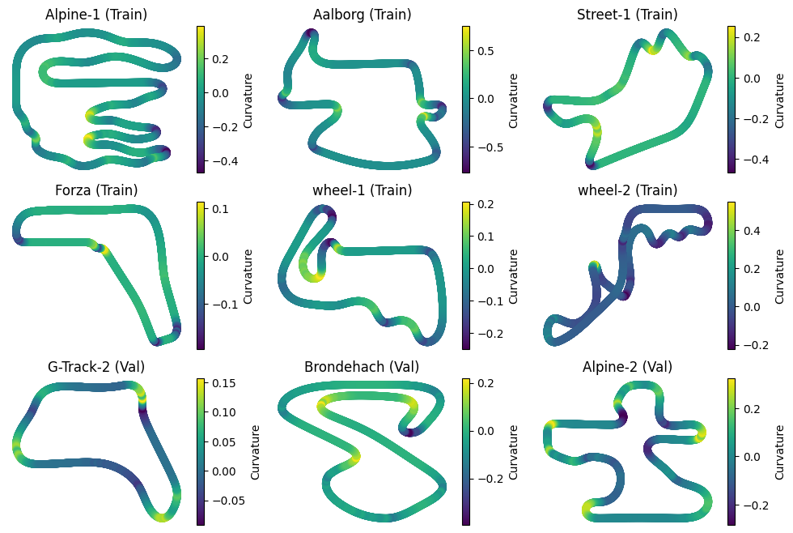
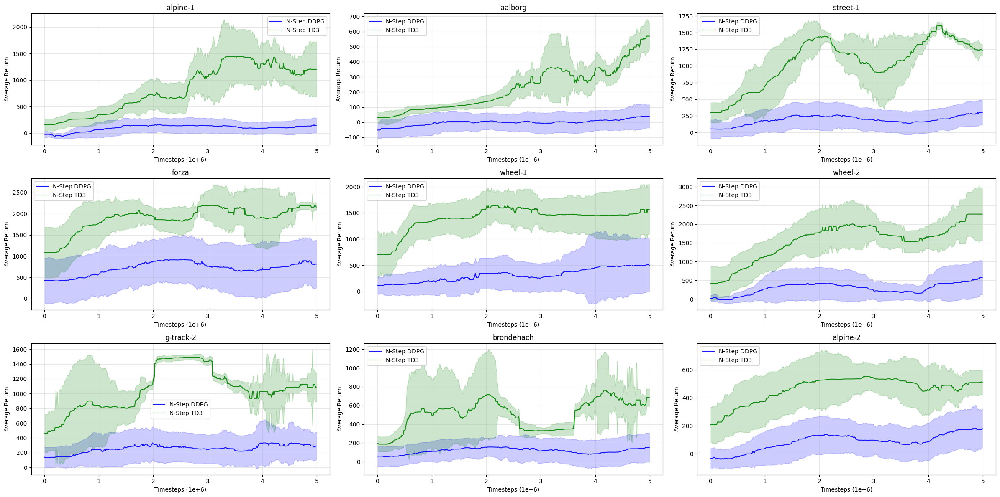

# torcsRL

There are several TORCS reinforcement learning projects, many of them are based on older codebases and use old versions of Keras or TensorFlow.

This repo provides a modern PyTorch implementation/interface for training RL agents in TORCS. It uses a Gymnasium environment interface and provides configurable training and evaluation tracks.

## Implemented Algoritms

* DDPG (N-Step)
* TD3 (N-Step)
* SAC (N-Step; Not evaluated yet - due to limited compute)
* TD7 (Not evaluated yet - due to limited compute )

## Experiment

Note that due to my limited compute resources, I evaluated only two algorithms: DDPG and TD3. Each algorithm was trained on the six training tracks and evaluated on the three validation tracks every 10,000 timesteps. Each algorithm was trained for 5 million timesteps and evaluated across three different seeds.

#### Training and Validation Tracks

<p align="center">
  
</p>

<p align="center"> <em>Figure 1: Training and validation tracks. Alpine-1, Aalborg, Street-1, Forza, Wheel-1, and Wheel-2 are used for training, while G-Track-2, Brondehach, and Alpine-2 are used for validation.</em> </p>

<p align="center">
  
</p>

<p align="center"> <em>Figure 2: Learning curves of DDPG and TD3 on training and validation tracks. </em> </p>

#### Results

#### Hyperparameters

| Algorithm | Timesteps | Actor LR | Critic LR | Batch size | Buffer size | Start steps | Discount | Polyak τ | Policy delay | Exploration |
| --- | ---: | ---: | ---: | ---: | ---: | ---: | ---: | ---: | ---: | --- |
| DDPG | 5,000,000 | 3e-4 | 3e-4 | 256 | 1,000,000 | 10,000 | 0.992 | 0.005 | 2 | Gaussian, σ = 0.1 |
| TD3 | 5,000,000 | 3e-4 | 3e-4 | 256 | 1,000,000 | 10,000 | 0.992 | 0.005 | 2 | Gaussian, σ = 0.1 |


## Usage

```python
import gymnasium as gym
import gym_torcs

from torcsrl import NStepTD3
from torcsrl.wrappers import TimedTrackSelectionWrapper, TrackSpec, HistoryWrapper


train_tracks = [
    TrackSpec("alpine-1", "road", "alpine_1_tita_expert.csv"),
    TrackSpec("aalborg", "road", "aalborg_tita_expert.csv"),
    TrackSpec("street-1", "road", "street_1_tita_expert.csv"),
    TrackSpec("forza", "road", "forza_tita_expert.csv"),
    TrackSpec("wheel-1", "road", "wheel_1_tita_expert.csv"),
    TrackSpec("wheel-2", "road", "wheel_2_tita_expert.csv"),
]

val_tracks = [
    # Training tracks
    TrackSpec("alpine-1", "road"),
    TrackSpec("aalborg", "road"),
    TrackSpec("street-1", "road"),
    TrackSpec("forza", "road"),
    TrackSpec("wheel-1", "road", "wheel_1_tita_expert.csv"),
    TrackSpec("wheel-2", "road", "wheel_2_tita_expert.csv"),

    # Validation tracks
    TrackSpec("g-track-1", "road"),
    TrackSpec("g-track-2", "road"),
    TrackSpec("brondehach", "road"),
    TrackSpec("alpine-2", "road"),
]


SEED = 0
HORIZON_OBS = 3
HORIZON_ACT = 3
SWITCH_TRACK_EVERY = 50_000

train_env = gym.make(
    "TorcsSCR-v0",
    render_mode=None,
    port=3001,
    race_type="practice",
    track_name="alpine-1",
    track_category="road",
    reset_strategy="relaunch",
    racing_line_csv="alpine_1_tita_expert.csv",
)
train_env = TimedTrackSelectionWrapper(
    train_env, tracks=train_tracks, switch_every_steps=SWITCH_TRACK_EVERY,
)
train_env = HistoryWrapper(train_env, HORIZON_OBS, HORIZON_ACT)


val_env = gym.make(
    "TorcsSCR-v0",
    render_mode=None,
    port=3002,
    race_type="practice",
    track_name="alpine-2",
    track_category="road",
    reset_strategy="relaunch",
    racing_line_csv="alpine_2_tita_expert.csv",
)
val_env = HistoryWrapper(val_env, HORIZON_OBS, HORIZON_ACT)
val_env = TimedTrackSelectionWrapper(
    val_env, val_tracks, switch_every_steps=1
)

alg = NStepTD3(
    train_env,
    val_env,
    n_steps=3,
    lr_actor=3e-4,
    lr_critic=3e-4,
    buffer_size=3_000_000,
    buffer_start_size=25_000,
    batch_size=256,
    tau_polyak=0.005,
    save_every=10_000,
    eval_every=10_000,
    device="cuda",
    seed=seed,
)

alg.train(5_000_000)
```

## Install

### Ubuntu 26.04

#### Install TORCS 1.3.7 with the SCR server patch

1. Clone the TORCS repository:

```bash
git clone https://github.com/raphaelsenn/torcs-1.3.7
```

2. Enter the repository:

```bash
cd torcs-1.3.7
```

3. Install the required packages:

```bash
sudo apt install -y \
    libglib2.0-dev \
    libgl1-mesa-dev \
    libglu1-mesa-dev \
    freeglut3-dev \
    libplib-dev \
    libopenal-dev \
    libalut-dev \
    libxi-dev \
    libxmu-dev \
    libxrender-dev \
    libxrandr-dev \
    libpng-dev \
    libvorbis-dev \
    gcc \
    g++ \
    make \
    cmake \
    automake \
    autoconf \
    libtool \
    libxxf86vm-dev \
    xautomation
```

4. Build and install TORCS:

```bash
make
sudo make install
sudo make datainstall
```

#### Install `torcsrl`

1. Clone the repository:

```bash
git clone https://github.com/raphaelsenn/torcsrl
```

2. Enter the repository:

```bash
cd torcsrl
```

3. Create and activate a conda environment:

```bash
conda create -n torcsrl python=3.11 -y
conda activate torcsrl
```

4. Install the Python requirements:

```bash
pip install -r requirements.txt
```

5. Install `torcsrl` in editable mode:

```bash
pip install -e .
```

### Fedora Linux 44 Workstation

#### Install TORCS 1.3.7 with the SCR server patch

1. Clone the TORCS repository:

```bash
git clone https://github.com/raphaelsenn/torcs-1.3.7
```

2. Enter the repository:

```bash
cd torcs-1.3.7
```

3. Install the required packages:

```bash
sudo dnf install \
  glib2-devel \
  mesa-libGL-devel \
  mesa-libGLU-devel \
  freeglut-devel \
  plib-devel \
  openal-soft-devel \
  freealut-devel \
  libXi-devel \
  libXmu-devel \
  libXrender-devel \
  libXrandr-devel \
  libpng-devel \
  libvorbis-devel \
  gcc \
  gcc-c++ \
  make \
  cmake \
  automake \
  autoconf \
  libtool \
  libXxf86vm-devel \
  xautomation
```

4. Build and install TORCS:

```bash
make
sudo make install
sudo make datainstall
```

You should now be able to start TORCS with:

```bash
sudo torcs
```

#### Install `torcsrl`

1. Clone the repository:

```bash
git clone https://github.com/raphaelsenn/torcsrl
```

2. Enter the repository:

```bash
cd torcsrl
```

3. Create and activate a conda environment:

```bash
conda create -n torcsrl python=3.11 -y
conda activate torcsrl
```

4. Install the Python requirements:

```bash
pip install -r requirements.txt
```

5. Install `torcsrl` in editable mode:

```bash
pip install -e .
```

## Citations

```bibtex
@misc{lillicrap2019continuouscontroldeepreinforcement,
      title={Continuous control with deep reinforcement learning}, 
      author={Timothy P. Lillicrap and Jonathan J. Hunt and Alexander Pritzel and Nicolas Heess and Tom Erez and Yuval Tassa and David Silver and Daan Wierstra},
      year={2019},
      eprint={1509.02971},
      archivePrefix={arXiv},
      primaryClass={cs.LG},
      url={https://arxiv.org/abs/1509.02971}, 
}

@misc{fujimoto2018addressingfunctionapproximationerror,
      title={Addressing Function Approximation Error in Actor-Critic Methods}, 
      author={Scott Fujimoto and Herke van Hoof and David Meger},
      year={2018},
      eprint={1802.09477},
      archivePrefix={arXiv},
      primaryClass={cs.AI},
      url={https://arxiv.org/abs/1802.09477}, 
}
```
