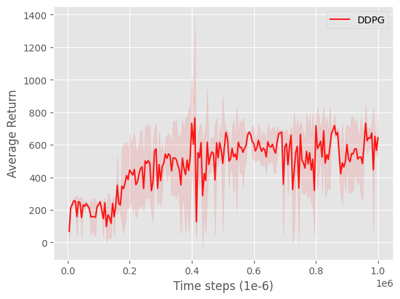

# torcsRL

There are already several open-source TORCS reinforcement learning projects, many of them are based on older codebases, use Keras or TensorFlow 1-style implementations, and mainly focus on DDPG with classical Ornstein-Uhlenbeck exploration noise.

This repo provides a cleaner and more modern PyTorch-based implementation for training RL agents in TORCS. It uses a Gymnasium-compatible interface, supports configurable training and evaluation tracks, and includes modern actor-critic algorithms such as TD3, PPO, and SAC.

## Training and Evaluation

### Alpine Challenge

The Alpine challenge uses two visually similar, but geometrically different, TORCS road tracks.
The agent is trained on `alpine-1` and evaluated on the unseen `alpine-2` track to test generalization.

| Split | Track | Distance | Preview |
| --- | --- | ---: | --- |
| Training | `alpine-1` | 6355.65 m |  |
| Evaluation | `alpine-2` | 3773.57 m |  |

<p align="center">
  
</p>

<p align="center">
  <em>Average return on the evaluation track <code>alpine-2</code>, evaluated every 5,000 training steps (averaged over 3 seeds).</em>
</p>

#### Hyperparameters

| Algorithm | Timesteps | Actor LR | Critic LR | Batch size | Buffer size | Start steps | Discount | Polyak τ | Policy delay | Exploration |
| --- | ---: | ---: | ---: | ---: | ---: | ---: | ---: | ---: | ---: | --- |
| DDPG | 1,000,000 | 3e-4 | 3e-4 | 256 | 1,000,000 | 25,000 | 0.99 | 0.005 | — | Gaussian, σ = 0.1 |
| TD3 | 1,000,000 | 3e-4 | 3e-4 | 256 | 1,000,000 | 25,000 | 0.99 | 0.005 | 2 | Gaussian, σ = 0.1 |

## Usage

```python
import gymnasium as gym
import gym_torcs

from torcsrl import EnvConfig, TD3


cfg = EnvConfig(
    executable = "/usr/local/bin/torcs"
    
    port_train = 3001 
    port_val = 3002

    track_category = "road"
    track_train = "alpine-1"
    track_val = "alpine-2"
)

alg = TD3(
    env_cfg = env_cfg,
    lr_actor = 3e-4
    lr_critic = 3e-4,
)

alg.train(n_timesteps = 1_000_000)
```

## Install

## Fedora Linux 44 Workstation

### Install TORCS 1.3.7 with the SCR server patch

1. Clone the TORCS repository:

```bash
git clone https://github.com/raphaelsenn/torcs-1.3.7
```

2. Enter the repository:

```bash
cd torcs-1.3.7
```

3. Install the required packages:

```bash
sudo dnf install \
  glib2-devel \
  mesa-libGL-devel \
  mesa-libGLU-devel \
  freeglut-devel \
  plib-devel \
  openal-soft-devel \
  freealut-devel \
  libXi-devel \
  libXmu-devel \
  libXrender-devel \
  libXrandr-devel \
  libpng-devel \
  libvorbis-devel \
  gcc \
  gcc-c++ \
  make \
  cmake \
  automake \
  autoconf \
  libtool \
  libXxf86vm-devel \
  xautomation
```

4. Build and install TORCS:

```bash
make
sudo make install
sudo make datainstall
```

You should now be able to start TORCS with:

```bash
sudo torcs
```

### Install `torcsrl`

1. Clone the repository:

```bash
git clone https://github.com/raphaelsenn/torcsrl
```

2. Enter the repository:

```bash
cd torcsrl
```

3. Create and activate a conda environment:

```bash
conda create -n torcsrl python=3.11 -y
conda activate torcsrl
```


4. Install the Python requirements:

```bash
pip install -r requirements.txt
```

5. Install `torcsrl` in editable mode:

```bash
pip install -e .
```

## Citations

```bibtex
@misc{lillicrap2019continuouscontroldeepreinforcement,
      title={Continuous control with deep reinforcement learning}, 
      author={Timothy P. Lillicrap and Jonathan J. Hunt and Alexander Pritzel and Nicolas Heess and Tom Erez and Yuval Tassa and David Silver and Daan Wierstra},
      year={2019},
      eprint={1509.02971},
      archivePrefix={arXiv},
      primaryClass={cs.LG},
      url={https://arxiv.org/abs/1509.02971}, 
}

@misc{fujimoto2018addressingfunctionapproximationerror,
      title={Addressing Function Approximation Error in Actor-Critic Methods}, 
      author={Scott Fujimoto and Herke van Hoof and David Meger},
      year={2018},
      eprint={1802.09477},
      archivePrefix={arXiv},
      primaryClass={cs.AI},
      url={https://arxiv.org/abs/1802.09477}, 
}
```
