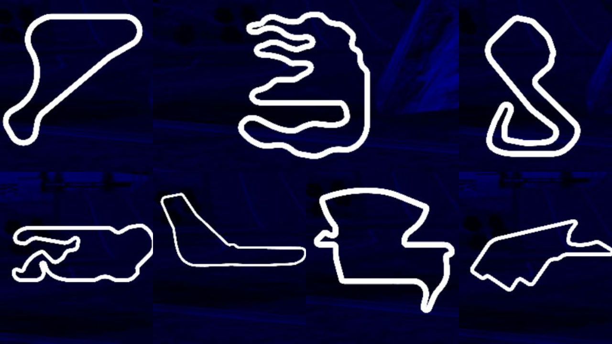

# torcsRL

There are several open-source TORCS reinforcement learning projects, many of them are based on older codebases, use Keras or TensorFlow 1-style implementations, and mainly focus on DDPG with classical Ornstein-Uhlenbeck exploration noise.

This repo provides a modern PyTorch-based implementation for training RL agents in TORCS. It uses a Gymnasium environment interface, supports configurable training and evaluation tracks, and includes modern actor-critic algorithms such as TD3, PPO, and SAC.

## Training and Evaluation

### Alpine-2 Challange

| Split | Track | Preview |
| --- | ---: | --- |
| Training | `Alpine-1`, `Aalborg`, `Street-1`, `Forza`, `E-Track-2`, `G-Track-1`, `Brondehach`  |  |
| Evaluation | `Alpine-2` |  |

<p align="center">
  
</p>

<p align="center">
  <em>Average return on the evaluation track <code>alpine-2</code>, evaluated every 5,000 training steps (averaged over 3 seeds).</em>
</p>

#### Hyperparameters

| Algorithm | Timesteps | Actor LR | Critic LR | Batch size | Buffer size | Start steps | Discount | Polyak τ | Policy delay | Exploration |
| --- | ---: | ---: | ---: | ---: | ---: | ---: | ---: | ---: | ---: | --- |
| DDPG | 5,000,000 | 1e-4 | 1e-3 | 32 | 5,000,000 | 50,000 | 0.99 | 0.001 | 2 | Gaussian, σ = 0.1 |
| TD3 | 5,000,000 | 1e-4 | 1e-3 | 32 | 5,000,000 | 50,000 | 0.99 | 0.005 | 2 | Gaussian, σ = 0.1 |

## Usage

```python
import gymnasium as gym
import gym_torcs

from torcsrl import TD3
from torcsrl.wrappers import TimedTrackSelectionWrapper, TrackSpec


train_tracks = [
    TrackSpec("alpine-1", "road", "alpine_1_tita_expert.csv"),
    TrackSpec("g-track-1", "road", "g_track_1_tita_expert.csv"),
    TrackSpec("street-1", "road", "street_1_tita_expert.csv"),
    TrackSpec("brondehach", "road", "brondehach_tita_expert.csv"),
    TrackSpec("aalborg", "road", "aalborg_tita_expert.csv"),
    TrackSpec("e-track-2", "road", "e_track_2_tita_expert.csv"),
    TrackSpec("forza", "road", "forza_tita_expert.csv"),
]


seed = 0

train_env = gym.make(
    "TorcsSCR-v0",
    render_mode=None,
    port=3001,
    race_type="practice",
    track_name="alpine-1",
    track_category="road",
    reset_strategy="relaunch",
    racing_line_csv="alpine_1_tita_expert.csv",
)

train_env = TimedTrackSelectionWrapper(
    train_env,
    tracks=train_tracks,
    switch_every_steps=50_000,
)

val_env = gym.make(
    "TorcsSCR-v0",
    render_mode=None,
    port=3002,
    race_type="practice",
    track_name="alpine-2",
    track_category="road",
    reset_strategy="relaunch",
    racing_line_csv="alpine_2_tita_expert.csv",
)

alg = TD3(
    train_env,
    val_env,
    lr_actor=1e-4,
    lr_critic=1e-3,
    buffer_size=5_000_000,
    buffer_start_size=50_000,
    batch_size=256,
    tau_polyak=0.005,
    save_every=5_000,
    eval_every=5_000,
    device="cuda",
    seed=seed,
)

alg.train(5_000_000)
```

## Install

## Fedora Linux 44 Workstation

### Install TORCS 1.3.7 with the SCR server patch

1. Clone the TORCS repository:

```bash
git clone https://github.com/raphaelsenn/torcs-1.3.7
```

2. Enter the repository:

```bash
cd torcs-1.3.7
```

3. Install the required packages:

```bash
sudo dnf install \
  glib2-devel \
  mesa-libGL-devel \
  mesa-libGLU-devel \
  freeglut-devel \
  plib-devel \
  openal-soft-devel \
  freealut-devel \
  libXi-devel \
  libXmu-devel \
  libXrender-devel \
  libXrandr-devel \
  libpng-devel \
  libvorbis-devel \
  gcc \
  gcc-c++ \
  make \
  cmake \
  automake \
  autoconf \
  libtool \
  libXxf86vm-devel \
  xautomation
```

4. Build and install TORCS:

```bash
make
sudo make install
sudo make datainstall
```

You should now be able to start TORCS with:

```bash
sudo torcs
```

### Install `torcsrl`

1. Clone the repository:

```bash
git clone https://github.com/raphaelsenn/torcsrl
```

2. Enter the repository:

```bash
cd torcsrl
```

3. Create and activate a conda environment:

```bash
conda create -n torcsrl python=3.11 -y
conda activate torcsrl
```


4. Install the Python requirements:

```bash
pip install -r requirements.txt
```

5. Install `torcsrl` in editable mode:

```bash
pip install -e .
```

## Citations

```bibtex
@misc{lillicrap2019continuouscontroldeepreinforcement,
      title={Continuous control with deep reinforcement learning}, 
      author={Timothy P. Lillicrap and Jonathan J. Hunt and Alexander Pritzel and Nicolas Heess and Tom Erez and Yuval Tassa and David Silver and Daan Wierstra},
      year={2019},
      eprint={1509.02971},
      archivePrefix={arXiv},
      primaryClass={cs.LG},
      url={https://arxiv.org/abs/1509.02971}, 
}

@misc{fujimoto2018addressingfunctionapproximationerror,
      title={Addressing Function Approximation Error in Actor-Critic Methods}, 
      author={Scott Fujimoto and Herke van Hoof and David Meger},
      year={2018},
      eprint={1802.09477},
      archivePrefix={arXiv},
      primaryClass={cs.AI},
      url={https://arxiv.org/abs/1802.09477}, 
}
```
